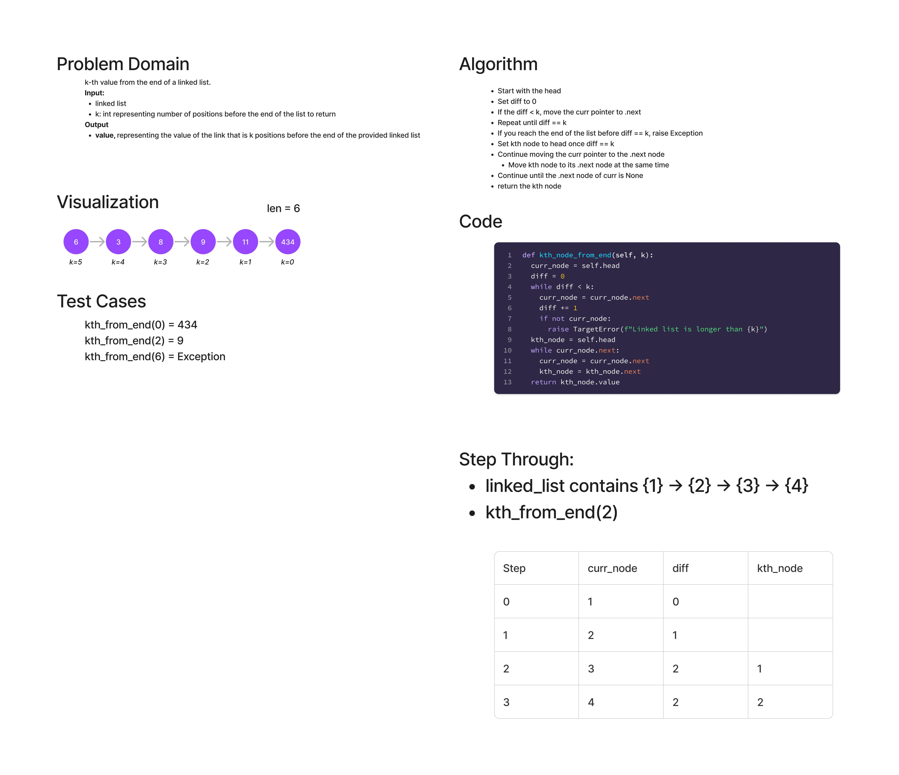

# K-th Value from the End of a Linked List

Find the node that is the kth from the end
- k is a non-negative integer
- Return the node's value that is k places from the tail of the linked list

## Whiteboard Process

## Approach & Efficiency
I started by traversing the linked list until we have reached kth nodes,
knowing that we would have to have at least that many nodes in the linked
list to produce a valid result. At that point, the node at the head of
the linked list would be the valid answer if we had already reached the end
of the list, so I called it the kth_node. (We need to keep track of the
correct answer, since we lose all knowledge of the previous nodes once
we travel to the next node unless that node is stored.)

At that point, I continued to traverse the remainder of the list, moving
both the curr_node pointer and the kth_node pointer at the same time, to
keep them k nodes apart. This continues until we reach the end of the list,
where .next is None.

Time Complexity is O(n), since there is a linear relationship between time
and the number of nodes in the list.

Space Complexity is O(1), since we are only saving the curr_node and the
kth_node of the list at any one time.

## Solution
To use this method, there must be a linked list in place. To run this
function once there is a linked list, simply enter:
  linked_list.nth_from_end(k)

where k is any non-negative integer.

If there is a linked list with values {1} -> {2} -> {3} -> {4}
then entering linked_list.nth_from_end(2) will return the value 2,
since it is two nodes away from the last node in the list.
