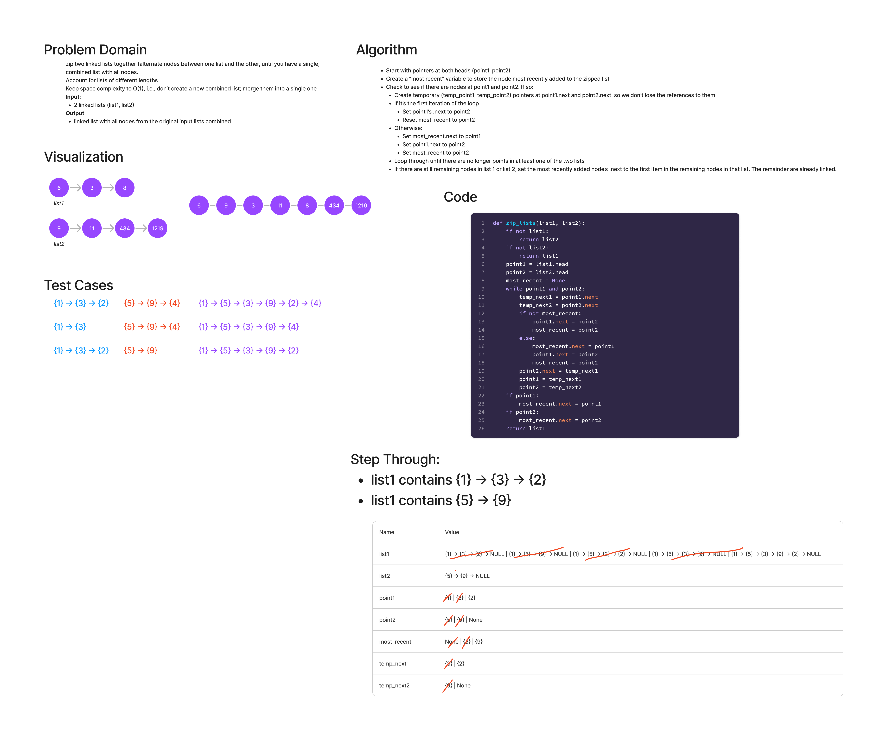

# Zip linked lists

Zip two linked lists

- Write a function called zip lists
- Arguments: 2 linked lists
- Return: New Linked List, zipped as noted below
- Zip the two linked lists together into one so that the nodes alternate between the two lists and return a reference to the the zipped list.
- Try and keep additional space down to O(1)

## Whiteboard Process

## Approach & Efficiency
I started by assigning two pointers, one to each head in the linked list.
In turn, the .next of each node is placed in a temporary variable so that
the references to those nodes are not lost when replacing the .next of
each node with the node referenced by the pointer from the alternate linked
list. The last zipped node is always kept track of with a separate variable,
so that it's .next can be set to the node referenced by the next pointer in the
sequence. This approach allows us to modify the list in-place, creating the O(1)
space complexity called for in the instructions.

Time Complexity is O(n), since there is a linear relationship between time
and the number of nodes in the list.

Space Complexity is O(1), since we are reusing a few temp variables throughout
the function, rather than creating a new function from scratch.

## Solution
Two linked lists must be supplied as input. The function zips them both together
in-place, and returns the modified first list.
