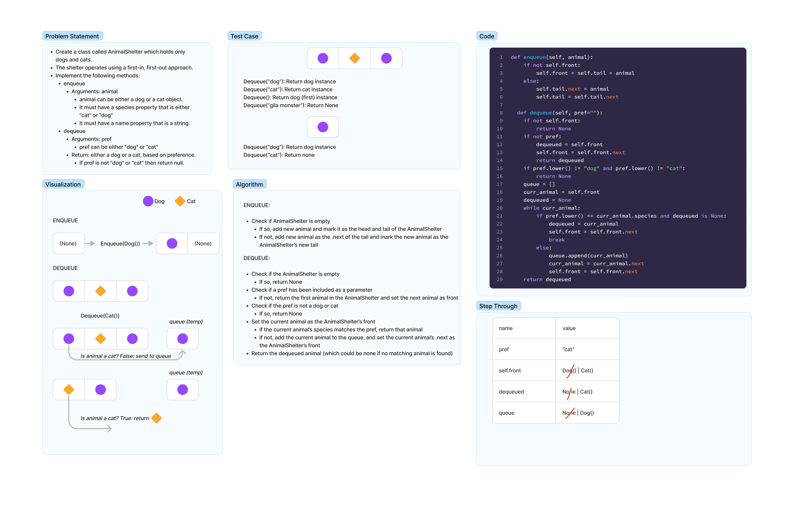

# Animal Shelter

- Create a class called AnimalShelter which holds only dogs and cats.
- The shelter operates using a first-in, first-out approach.
- Implement the following methods:
  - enqueue
    - Arguments: animal
    - animal can be either a dog or a cat object.
    - It must have a species property that is either "cat" or "dog"
    - It must have a name property that is a string.
  - dequeue
    - Arguments: pref
    - pref can be either "dog" or "cat"
    - Return: either a dog or a cat, based on preference.
    - If pref is not "dog" or "cat" then return null.

## Whiteboard Process

## Approach & Efficiency

Each animal is placed in an Animal Shelter, which is essentially a queue. When an dequeue
request is made, we traverse through the queue, checking if each animal along the way is
of the species that is being asked for. If not, the non-matching animal is moved to a temporary
queue and the next animal is the new front of the queue.

### Big O

- Time Complexity: O(n), since the AnimalShelter will potentially be traversed once.
- Space Complexity: O(n), since the temporary queue could be as long as the animal shelter.

## Solution

Run the enqueue or dequeue methods of the AnimalShelter class.
