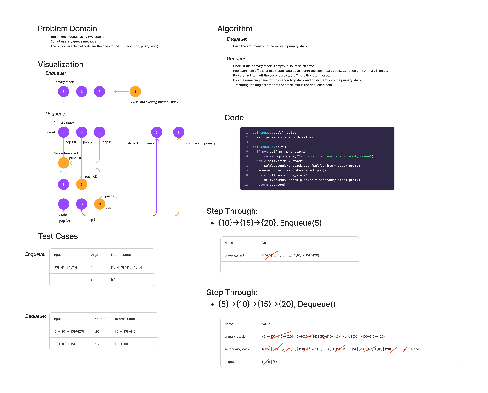

# PsuedoQueue

Implement a queue using two stacks

Do not use an existing Queue.
Instead, this PseudoQueue class will implement our standard queue interface (the two methods listed below),
Internally, utilize 2 Stack instances to create and manage the queue

## Whiteboard Process

## Approach & Efficiency
Enqueueing, using stacks, is essentially just a push operation to the top of
the queue.

Time complexity: O(1)
Space complexity: O(1)

Dequeueing, using stacks, involves popping each item off the original stack and
then pushing them onto the secondary stack, effectively reversing the order of
the nodes. The top node can then be popped off the secondary result, providing
the return of the function. The remaining nodes on the secondary stack can
be pushed back onto the first stack, restoring the order.

Time Complexity is O(n), since the entire stack has to be traversed (twice).

Space Complexity is O(n), because a second stack has to be created that has
as many nodes as the original stack.

