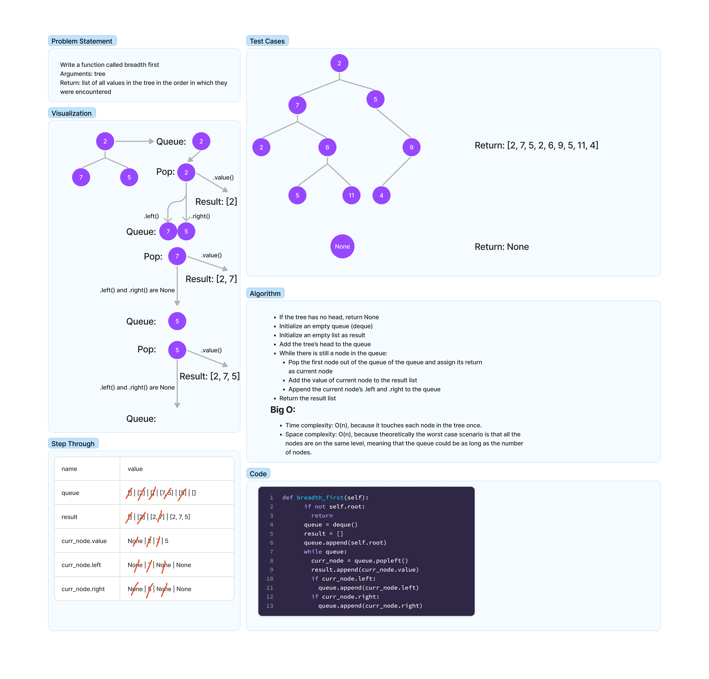

# Breadth-First Traversal

- Write a function called breadth first
- Arguments: tree
- Return: list of all values in the tree, in the order they were encountered

## Whiteboard Process

## Approach & Efficiency
I created a queue, starting with the first node in the tree. The queue would then
have its front popped, and the value of the queue would be added to the result
list. That node's .left and .right would then be added to the queue. The .left
would then be the queue's front, and it would be popped next. The process repeats
until there are no more nodes in the queue.

### Big O

Time Complexity: O(n), since each node is visited once.

Space Complexity: O(n), since the worst-case scenario here is a tree with all its nodes in the same branch, meaning that the queue would be as long as the number of nodes in the tree.

## Solution
[Breadth-First Search](../../code_challenges/tree_breadth_first.py)
