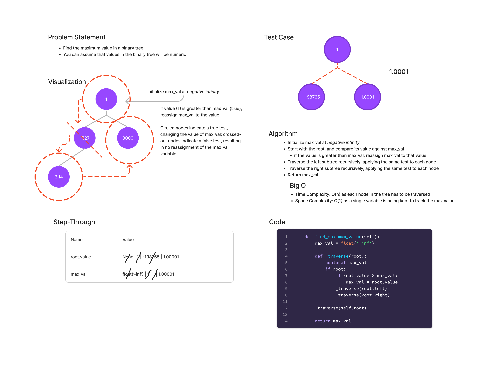

# Max Value (Binary Tree)
Find the maximum value in a binary tree

## Whiteboard Process

## Approach & Efficiency
I completed a depth-first traversal (preorder) of the tree and
compared the value of each node against the current `max_val`
variable, replacing the value whenever the current node's value
was greater.

Traversing each node one: Time complexity: O(n)
Maintaining a single variable to keep track of max: Space complexity O(1)

## Solution
Invoke the find_maximum_value method of the Binary Tree class.
