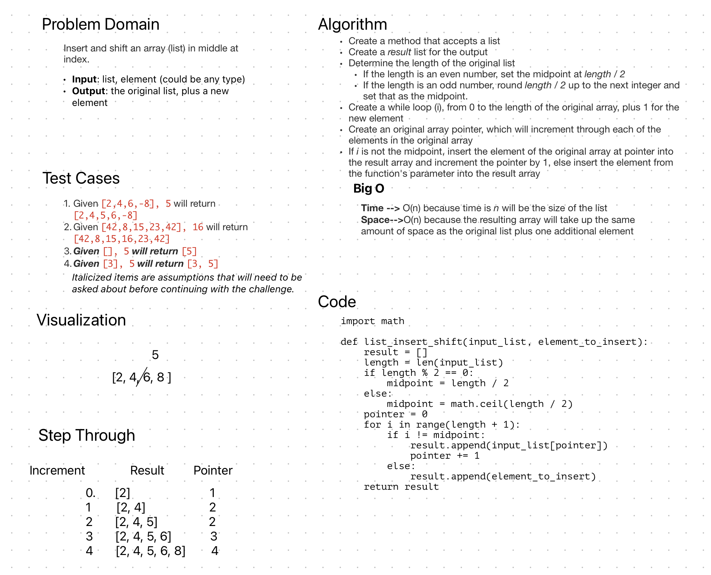

# List-Insert-Shift

Insert and shift an list in middle at index

## Whiteboard Process

## Approach & Efficiency

After calculating the midpoint of the original list,
I created a new (result) list to store the new list
with the insertion. Going through a for loop, if the iterator
was not equal to the midpoint, I inserted the element from
that point in the original list, and if it was equal to the
midpoint, I inserted the element_to_insert parameter from the
function call. A pointer element kept track of the next element
in the original list to insert, since the iterator and index
would no longer align once the parameter element was added.

Time: O(n), n = number of items in the list
Space: O(n), a new list is created the same
size as the original, plus one element.
