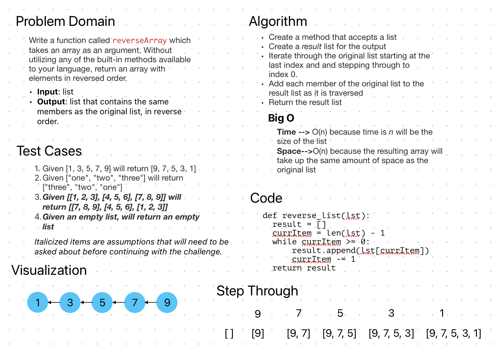

# Reverse List

## Whiteboard Process

## Approach & Efficiency

I iterated through the list in reverse order,
beginning with the highest index. For each
each index, the item is appended to a new _result_
array.

Time: O(n), n = number of items in the array
Space: O(n), a new array is created the same
size as the original

