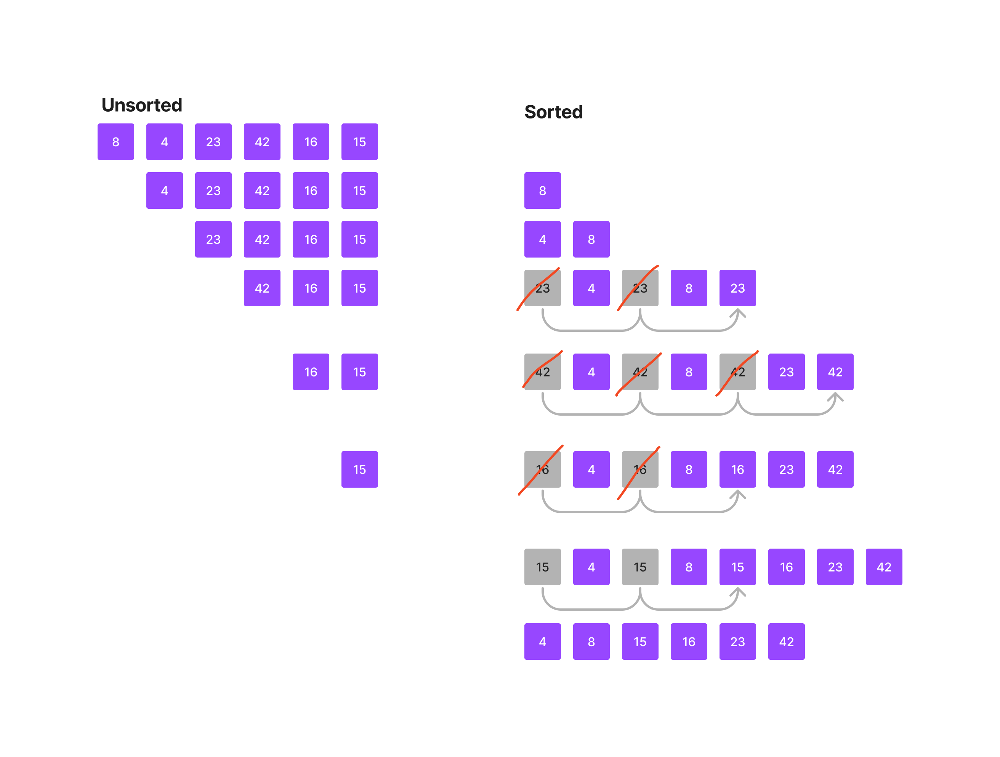

# Blog Notes: Insertion Sort

Insertion Sort is a sorting algorithm in which sorting occurs one
element at a time. It iterates through the unsorted portion of the
array and inserts each element into a new, sorted array, by
inserting the element and shifting it to the right until it finds
its correct position among the currently sorted elements.

## Pseudocode
```pseudocode
Insert(int[] sorted, int value)
  initialize i to 0
  WHILE value > sorted[i]
    set i to i + 1
  WHILE i < sorted.length
    set temp to sorted[i]
    set sorted[i] to value
    set value to temp
    set i to i + 1
  append value to sorted

InsertionSort(int[] input)
  LET sorted = New Empty Array
  sorted[0] = input[0]
  FOR i from 1 up to input.length
    Insert(sorted, input[i])
  return sorted
```
## Trace

### Sample List

[8, 4, 23, 42, 16, 15]



## Code

```python
def insert(sorted, val):
  i = 0
  while val < sorted[i]:
    i += 1
  while 1 < len(sorted):
    temp = sorted[1]
    sorted[1] = val
    val = temp
    i += 1
  sorted.append(val)

def insertion_sort(input):
  sorted = [input[0]]
  for i in range(1, len(input)):
    insert(sorted, input[i])
  return sorted
```

## Big O

### Time Efficiency: O(n^2), as you are essentially creating nested loops that iterate over the elements
### Space Efficiency: O(n), as a new list is being created the same size as the original
